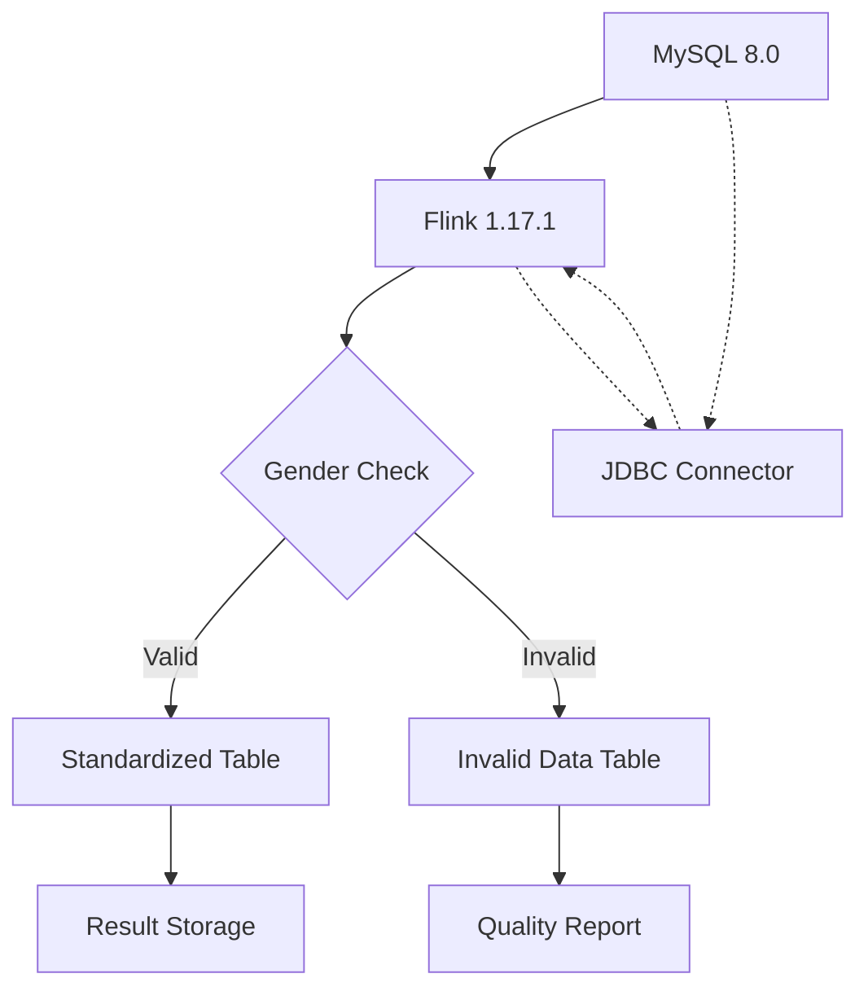

# Flink Docker 部署与政府个人信息处理系统需求文档

## 项目概述

本项目旨在构建一个基于 Docker Compose 的 Flink 1.17.1 大数据处理环境，用于政府个人信息的数据质量稽查与标准化处理。系统通过 Flink JDBC Connector 连接 MySQL 8.0 数据库，实现对个人基本信息表的清洗、校验和标准化转换功能。项目采用微服务架构，支持水平扩展，具备高可用性和易维护性。

## 目标与范围

### 项目目标
- 构建稳定、可靠的 Flink 批处理环境
- 实现政府个人信息数据的质量稽查和标准化转换
- 提供可复用、易扩展的数据处理框架
- 保证数据处理过程的安全性与准确性

### 功能范围
- **数据源接入**：通过 Flink JDBC Connector 连接 MySQL 数据库
- **数据质量稽查**：检测并分离不符合标准的性别字段数据
- **数据标准化**：将多种性别表达统一转换为标准格式
- **结果存储**：将稽查结果和标准化数据分别存储到指定表中

## 系统架构图



系统采用典型的 ETL 架构，数据从 MySQL 源表通过 Flink 的 JDBC Connector 读取，经过质量检查后分为有效数据和无效数据两条处理路径，最终分别写入标准化表和质量报告表。

## 环境与依赖要求

### 系统要求
- **操作系统**：Linux/macOS/Windows (支持 Docker)
- **内存**：至少 4GB 可用内存
- **磁盘空间**：至少 2GB 可用空间
- **Docker**：版本 18.09+
- **Docker Compose**：版本 1.25+

### 软件依赖
- **Flink**：1.17.1 版本
- **MySQL**：8.0 版本
- **Java**：JDK 8 或更高版本（运行时环境）
- **Flink JDBC Connector**：对应 Flink 1.17.1 版本

## 详细部署步骤

### 目录结构创建
```bash
mkdir -p /opt/flink_docker/docker
mkdir -p /opt/flink_docker/sql
mkdir -p /opt/flink_docker/data/mysql
```

### Docker Compose 配置文件

```yaml
version: '3.8'

services:
  mysql:
    image: mysql:8.0
    container_name: mysql-server
    environment:
      MYSQL_ROOT_PASSWORD: root_password
      MYSQL_DATABASE: gov_db
      MYSQL_USER: flink_user
      MYSQL_PASSWORD: flink_password
    ports:
      - "3306:3306"
    volumes:
      - ./data/mysql:/var/lib/mysql
      - ./init:/docker-entrypoint-initdb.d
    networks:
      - flink-network
    restart: unless-stopped

  jobmanager:
    image: flink:1.17.1-scala_2.12-java8
    container_name: flink-jobmanager
    ports:
      - "8081:8081"
    command: jobmanager
    environment:
      - |
        FLINK_PROPERTIES=
        jobmanager.rpc.address: jobmanager
        taskmanager.numberOfTaskSlots: 4
        parallelism.default: 2
        env.java.opts: -Xmx2g
    volumes:
      - ./lib:/opt/flink/lib
      - ./sql:/opt/flink/sql
    networks:
      - flink-network
    depends_on:
      - mysql
    restart: unless-stopped

  taskmanager:
    image: flink:1.17.1-scala_2.12-java8
    container_name: flink-taskmanager
    ports:
      - "8082:8082"
    depends_on:
      - jobmanager
    command: taskmanager
    environment:
      - |
        FLINK_PROPERTIES=
        jobmanager.rpc.address: jobmanager
        taskmanager.numberOfTaskSlots: 4
        parallelism.default: 2
        env.java.opts: -Xmx2g
    volumes:
      - ./lib:/opt/flink/lib
      - ./sql:/opt/flink/sql
    networks:
      - flink-network
    restart: unless-stopped

networks:
  flink-network:
    driver: bridge

volumes:
  mysql_data:
    driver: local
```

将以上内容保存到 `/opt/flink_docker/docker/docker-compose.yml` 文件中。

### 启动命令
```bash
cd /opt/flink_docker/docker
docker-compose up -d
```

### 验证方式
- 访问 Flink Web UI：http://localhost:8081
- 检查容器状态：`docker-compose ps`
- 连接 MySQL 验证：`mysql -h localhost -u flink_user -p`

## 数据准备与示例说明

### 初始化 SQL 脚本

创建初始化脚本 `/opt/flink_docker/init/init.sql`：
```sql
-- 创建数据库
CREATE DATABASE IF NOT EXISTS gov_db;
USE gov_db;

-- 创建原始数据表
CREATE TABLE IF NOT EXISTS gov_person_info (
    id INT AUTO_INCREMENT PRIMARY KEY,
    name VARCHAR(100) NOT NULL,
    gender VARCHAR(10),
    id_card VARCHAR(18),
    birth_date DATE
);

-- 创建质量稽查表
CREATE TABLE IF NOT EXISTS gov_person_invalid_gender (
    id INT,
    name VARCHAR(100),
    gender VARCHAR(10),
    id_card VARCHAR(18),
    birth_date DATE,
    invalid_reason VARCHAR(255),
    processed_time TIMESTAMP DEFAULT CURRENT_TIMESTAMP
);

-- 创建标准化结果表
CREATE TABLE IF NOT EXISTS gov_person_standardized (
    id INT,
    name VARCHAR(100),
    gender VARCHAR(10),
    id_card VARCHAR(18),
    birth_date DATE,
    processed_time TIMESTAMP DEFAULT CURRENT_TIMESTAMP
);

-- 插入 100 条测试数据
INSERT INTO gov_person_info (name, gender, id_card, birth_date) VALUES
('张三', '男', '110101199001011234', '1990-01-01'),
('李四', '女', '110101199102022345', '1991-02-02'),
('王五', 'M', '110101199203033456', '1992-03-03'),
('赵六', 'F', '110101199304044567', '1993-04-04'),
('钱七', 'S', '110101199405055678', '1994-05-05'),
('孙八', 'MALE', '110101199506066789', '1995-06-06'),
('周九', 'male', '110101199607077890', '1996-07-07'),
('吴十', 'FEMALE', '110101199708088901', '1997-08-08'),
('郑一', 'female', '110101199809099012', '1998-09-09'),
('陈二', 'N', '110101199910100123', '1999-10-10');
-- ... 继续插入更多数据，确保 gender 各种写法均匀分布
-- 为简化示例，这里仅展示前10条记录
-- 实际需要生成100条记录，其中约10%使用非标准格式
```

## Flink SQL 处理逻辑

创建 `/opt/flink_docker/sql/process_person_data.sql` 文件：

```sql
-- 创建源表连接器，用于读取 MySQL 中的政府个人信息表
CREATE TABLE source_gov_person_info (
    id INT,
    name STRING,
    gender STRING,
    id_card STRING,
    birth_date DATE,
    -- 定义主键约束
    WATERMARK FOR birth_date AS birth_date
) WITH (
    'connector' = 'jdbc',
    'url' = 'jdbc:mysql://mysql:3306/gov_db',
    'table-name' = 'gov_person_info',
    'username' = 'flink_user',
    'password' = 'flink_password',
    'driver' = 'com.mysql.cj.jdbc.Driver'
);

-- 创建异议数据表连接器，用于存储性别字段不符合标准的数据
CREATE TABLE sink_invalid_gender (
    id INT,
    name STRING,
    gender STRING,
    id_card STRING,
    birth_date DATE,
    invalid_reason STRING,
    processed_time TIMESTAMP(3)
) WITH (
    'connector' = 'jdbc',
    'url' = 'jdbc:mysql://mysql:3306/gov_db',
    'table-name' = 'gov_person_invalid_gender',
    'username' = 'flink_user',
    'password' = 'flink_password',
    'driver' = 'com.mysql.cj.jdbc.Driver',
    -- 设置写入模式为 append，表示追加数据
    'sink.buffer-flush.max-rows' = '1000',
    'sink.buffer-flush.interval' = '2s'
);

-- 创建标准化结果表连接器，用于存储经过标准化处理的数据
CREATE TABLE sink_standardized_person (
    id INT,
    name STRING,
    gender STRING,
    id_card STRING,
    birth_date DATE,
    processed_time TIMESTAMP(3)
) WITH (
    'connector' = 'jdbc',
    'url' = 'jdbc:mysql://mysql:3306/gov_db',
    'table-name' = 'gov_person_standardized',
    'username' = 'flink_user',
    'password' = 'flink_password',
    'driver' = 'com.mysql.cj.jdbc.Driver',
    -- 设置写入性能优化参数
    'sink.buffer-flush.max-rows' = '1000',
    'sink.buffer-flush.interval' = '2s'
);

-- 第一步：数据质量稽查，筛选出性别字段不在标准范围内的记录
-- 标准范围定义为：'男','女','M','F' (大小写敏感)
-- 将不符合标准的记录写入异议表
INSERT INTO sink_invalid_gender
SELECT
    id,
    name,
    gender,
    id_card,
    birth_date,
    '性别字段不在标准范围内' AS invalid_reason,
    PROCTIME() AS processed_time
FROM source_gov_person_info
WHERE gender NOT IN ('男', '女', 'M', 'F');

-- 第二步：数据标准化处理，将性别字段转换为统一格式
-- 规则：'男'和'M'统一转换为'M'，'女'和'F'统一转换为'F'
-- 对于不符合标准的记录不进行转换，保持原值以便后续处理
INSERT INTO sink_standardized_person
SELECT
    id,
    name,
    CASE
        WHEN gender IN ('男', 'M') THEN 'M'      -- 男性统一转换为 'M'
        WHEN gender IN ('女', 'F') THEN 'F'      -- 女性统一转换为 'F'
        ELSE gender                              -- 其他情况保持原值
    END AS gender,
    id_card,
    birth_date,
    PROCTIME() AS processed_time
FROM source_gov_person_info;
```

## 运行验证步骤

### 1. 启动服务
```bash
# 启动 Docker Compose 服务
cd /opt/flink_docker/docker
docker-compose up -d

# 等待服务完全启动（约1-2分钟）
# 可以通过访问 http://localhost:8081 查看 Flink UI 状态
```

### 2. 准备 Flink JDBC Connector
下载适用于 Flink 1.17.1 的 MySQL 连接器 JAR 文件，并放置到 lib 目录：
```bash
# 创建 lib 目录
mkdir -p /opt/flink_docker/lib

# 下载 MySQL 连接器（请根据实际情况替换下载链接）
wget -O /opt/flink_docker/lib/flink-connector-jdbc_2.12-1.17.1.jar \
  https://repo.maven.apache.org/maven2/org/apache/flink/flink-connector-jdbc_2.12/1.17.1/flink-connector-jdbc_2.12-1.17.1.jar

wget -O /opt/flink_docker/lib/mysql-connector-java-8.0.33.jar \
  https://repo.maven.apache.org/maven2/mysql/mysql-connector-java/8.0.33/mysql-connector-java-8.0.33.jar
```

### 3. 执行 Flink SQL 任务
有两种方式执行 SQL：

**方式一：使用 Flink SQL Client**
```bash
# 进入 JobManager 容器
docker exec -it flink-jobmanager bash

# 运行 SQL 脚本
./bin/sql-client.sh -f /opt/flink/sql/process_person_data.sql
```

**方式二：使用 Flink REST API 提交任务**

### 4. 验证处理结果
```bash
# 连接到 MySQL 验证结果
docker exec -it mysql-server mysql -u flink_user -p gov_db

# 检查源表记录数
SELECT COUNT(*) FROM gov_person_info;

# 检查异议表记录数（应该包含所有非标准性别格式的记录）
SELECT COUNT(*) FROM gov_person_invalid_gender;

# 检查结果表记录数（应该与源表相同）
SELECT COUNT(*) FROM gov_person_standardized;

# 检查结果表中性别分布情况
SELECT gender, COUNT(*) as count FROM gov_person_standardized GROUP BY gender;
```

### 5. 验证点确认
- 源表 `gov_person_info` 应有 100 条记录
- 异议表 `gov_person_invalid_gender` 应有约 10 条记录（具体数量取决于初始化数据中异常值的数量）
- 结果表 `gov_person_standardized` 应有 100 条记录
- 结果表中性别字段应只有 'M' 和 'F' 两种值（除异常记录外）

## 项目目录结构

```
/opt/flink_docker/
├── docker/
│   └── docker-compose.yml          # Docker Compose 配置文件
├── init/
│   └── init.sql                    # MySQL 初始化脚本
├── sql/
│   └── process_person_data.sql     # Flink SQL 处理逻辑
├── lib/                            # 存放 Flink 连接器 JAR 包
│   ├── flink-connector-jdbc_2.12-1.17.1.jar
│   └── mysql-connector-java-8.0.33.jar
├── data/
│   └── mysql/                      # MySQL 数据持久化目录
└── flink_docker_rq.md              # 本需求文档
```

## README.md 建议内容

```markdown
# Flink Government Person Info Processing

基于 Flink 的政府个人信息处理系统，用于数据质量稽查和标准化转换。

## 项目背景

政府信息系统中存在大量个人信息数据，由于历史原因和录入规范不一致，导致数据格式不统一。本项目旨在构建一个高效的数据处理系统，实现对个人基本信息的标准化处理。

## 技术栈

- Apache Flink 1.17.1
- MySQL 8.0
- Docker & Docker Compose
- Java 8+

## 目录结构

```
.
├── docker/                 # Docker 相关配置
├── init/                   # 数据库初始化脚本
├── sql/                    # Flink SQL 脚本
├── lib/                    # 依赖 JAR 包
└── data/                   # 数据持久化目录
```

## 快速启动

1. 克隆仓库并进入项目目录
2. 创建必要的目录结构
3. 下载 Flink JDBC 连接器 JAR 包到 lib 目录
4. 启动服务：`cd docker && docker-compose up -d`
5. 执行 SQL 处理逻辑
6. 验证结果

## 注意事项

- 确保系统有足够的内存资源（推荐 4GB+）
- 数据库密码请在生产环境中使用更安全的设置
- 定期备份处理结果数据
- 监控 Flink 任务执行状态，确保数据处理正常
```